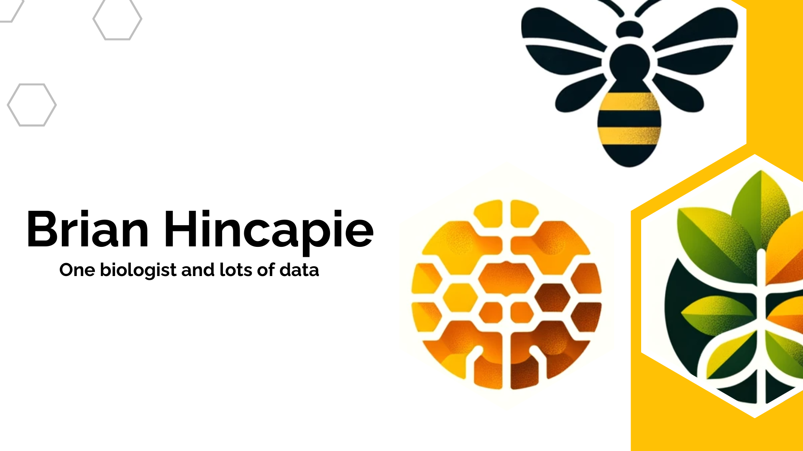

# Welcome to a biologist's Github

I am a biologist specialized in pollinators and ecological data analysis. My work focuses on understanding plant–pollinator interactions, particularly involving native stingless bees, through field research, pollen identification, and statistical modeling.
## Skills

